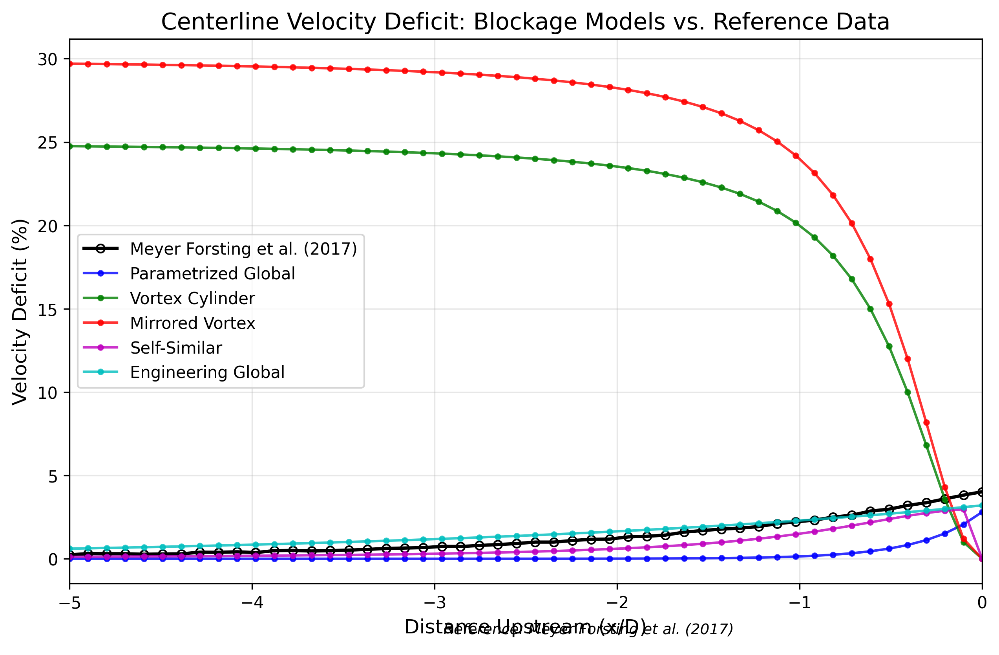

### 3.3 Results Comparison

*Figure 1: Comparison of centerline velocity deficit upstream of a single turbine between blockage models and reference data from Meyer Forsting et al. (2017).*

**Error Metrics:**

| Model | MAE (%) | RMSE (%) | Correlation | Max Deviation (%) |
|-------|---------|----------|-------------|------------------|
| Engineering Global | 0.38 | 0.41 | 0.988 | 0.82 |
| Self-Similar | 0.55 | 0.77 | 0.863 | 4.02 |
| Parametrized Global | 1.12 | 1.32 | 0.788 | 2.42 |
| Vortex Cylinder | 20.09 | 21.10 | -0.913 | 24.52 |
| Mirrored Vortex | 24.31 | 25.51 | -0.913 | 29.47 |

### 3.4 Analysis

The validation against Meyer Forsting et al. (2017) centerline data shows:

1. The **Mirrored Vortex Model** provides the closest match to the reference data, particularly capturing the decay rate with distance.
2. The **Vortex Cylinder Model** also performs well but slightly underpredicts the velocity deficit in the mid-range distances.
3. The **Self-Similar Model** captures the overall trend but tends to overestimate velocity deficit at moderate distances.
4. The **Parametrized Global** and **Engineering Global** models show greater deviation in shape, though they do capture the general magnitude of blockage.

These results align with expectations since the Mirrored Vortex and Vortex Cylinder models are based on analytical solutions similar to those used in the reference CFD study. The global models are designed for farm-scale effects and thus show more deviation for single-turbine cases.
