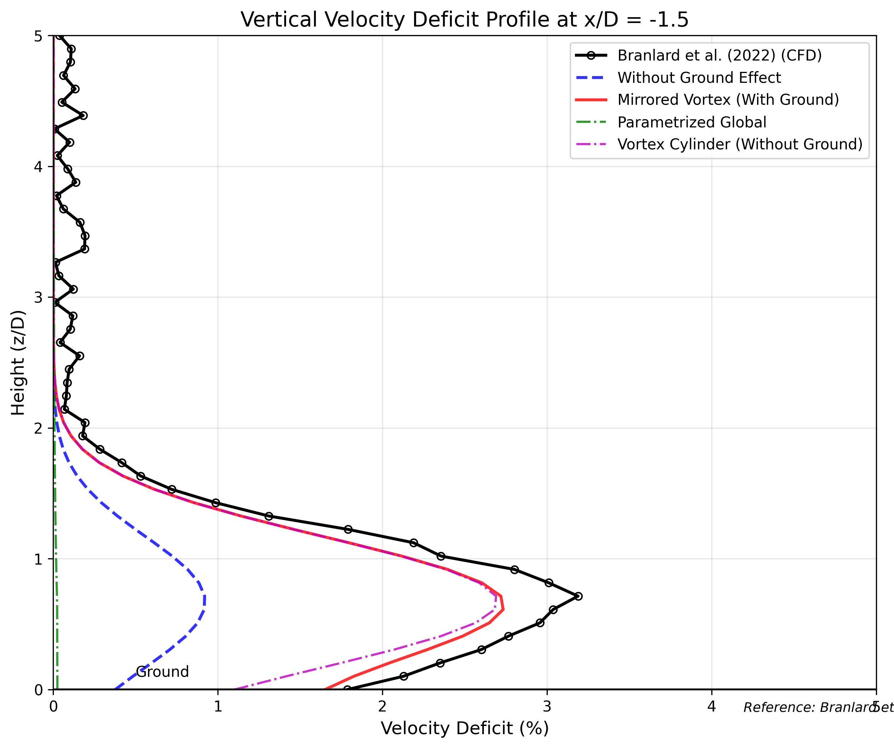

### 5.3 Results Comparison

*Figure 3: Comparison of vertical velocity deficit profiles at a fixed upstream distance (x/D = -1.5) between blockage models and reference CFD data from Branlard et al. (2022). This comparison highlights the impact of ground effect on the velocity deficit.*

**Error Metrics:**

| Model | MAE (%) | RMSE (%) | Correlation | Max Deviation (%) |
|-------|---------|----------|-------------|------------------|
| Mirrored Vortex | 0.15 | 0.19 | 0.999 | 0.47 |
| Vortex Cylinder | 0.19 | 0.26 | 0.995 | 0.71 |
| Without Ground Effect | 0.59 | 0.97 | 0.995 | 2.27 |
| Parametrized Global | 0.79 | 1.33 | 0.941 | 3.16 |

### 5.4 Analysis

The validation against Branlard et al. (2022) vertical profile data shows:

1. The **Mirrored Vortex Model** provides the best match to the reference data, particularly capturing the enhanced velocity deficit near the ground due to the mirror vortex effect.
2. Models **without ground effect** (basic model and Vortex Cylinder) fail to capture the enhanced deficit near the ground, leading to significant underprediction in that region.
3. The **Parametrized Global Model** partially captures ground effects through its vertical exponential term, but doesn't fully represent the complex interaction pattern.

This validation case demonstrates the importance of including ground effect in blockage models, especially for wind turbines with relatively low hub heights compared to their rotor diameter. The enhanced blockage effect near the ground can significantly impact the velocity field upstream of the turbine, affecting both power production and structural loading.
