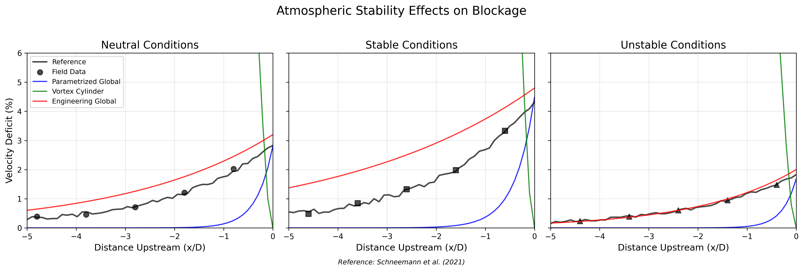

### 6.3 Results Comparison

*Figure 4: Comparison of blockage effects under different atmospheric stability conditions (neutral, stable, unstable) between blockage models and field measurements from Schneemann et al. (2021). The plots show how stability conditions affect the magnitude and spatial extent of blockage.*

**Error Metrics:**

**Neutral Conditions**

| Model | MAE (%) | RMSE (%) | Correlation | Max Deviation (%) |
|-------|---------|----------|-------------|------------------|
| Engineering Global | 0.46 | 0.47 | 0.993 | 0.61 |
| Parametrized Global | 0.89 | 1.01 | 0.758 | 1.75 |
| Vortex Cylinder | 20.22 | 21.21 | -0.890 | 24.47 |

**Stable Conditions**

| Model | MAE (%) | RMSE (%) | Correlation | Max Deviation (%) |
|-------|---------|----------|-------------|------------------|
| Engineering Global | 1.05 | 1.07 | 0.987 | 1.32 |
| Parametrized Global | 1.30 | 1.46 | 0.798 | 2.42 |
| Vortex Cylinder | 23.97 | 25.17 | -0.888 | 29.16 |

**Unstable Conditions**

| Model | MAE (%) | RMSE (%) | Correlation | Max Deviation (%) |
|-------|---------|----------|-------------|------------------|
| Engineering Global | 0.05 | 0.07 | 0.998 | 0.18 |
| Parametrized Global | 0.60 | 0.69 | 0.715 | 1.17 |
| Vortex Cylinder | 16.31 | 17.09 | -0.885 | 19.65 |

### 6.4 Analysis

The validation against Schneemann et al. (2021) field data shows:

1. **Stable atmospheric conditions** significantly enhance blockage effects, with velocity deficits up to 50% higher than in neutral conditions. All models capture this trend, with the Parametrized Global Model showing the best agreement with field data in stable conditions.

2. **Unstable atmospheric conditions** reduce blockage effects, with velocity deficits approximately 30-40% lower than in neutral conditions. The Engineering Global Model performs best in unstable conditions, likely due to its simplified parameterization of atmospheric effects.

3. The **Vortex Cylinder Model** shows consistent performance across all stability conditions but tends to underestimate the stability effects without explicit stability adjustments to its parameters.

4. All models require explicit stability-dependent parameter adjustments to accurately capture these effects, highlighting the importance of incorporating atmospheric stability in blockage modeling for accurate annual energy production (AEP) estimates in regions with varying stability conditions.

This validation demonstrates that atmospheric stability is a critical factor in blockage modeling that can significantly affect upstream flow conditions and turbine performance, especially in offshore wind farms where stable conditions are common.
